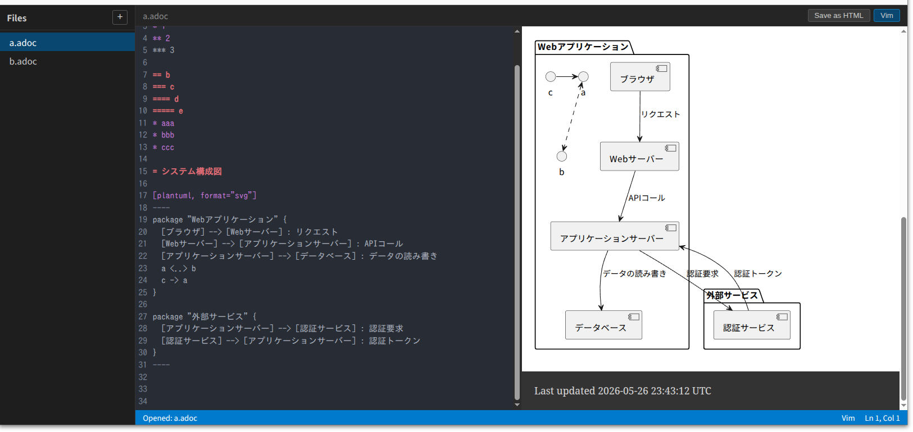

# AsciiDoc Editor

AsciiDocファイルをリアルタイムプレビュー付きで編集できるWebベースのエディタ。



## 機能

- **リアルタイムプレビュー** — WebSocket経由でAsciiDocをレンダリング、編集内容を即時反映
- **ファイル管理** — サイドバーからファイル/フォルダの作成・削除・選択
- **自動保存** — 編集停止から1秒後に自動保存
- **Vimキーバインド** — Vim/通常モードをトグル切替
- **ダイアグラム対応** — PlantUML・Mermaidダイアグラムをレンダリング（asciidoctor-diagram）
- **HTMLエクスポート** — ソースと同じディレクトリにHTMLを出力

## 技術スタック

- **フロントエンド**: CodeMirror 6、One Dark テーマ、ESBuild
- **バックエンド**: Node.js、Express、ws（WebSocket）
- **レンダリング**: asciidoctor CLI、asciidoctor-diagram

## セットアップ

### ローカル実行

```bash
npm install
npm run build
npm start
```

http://localhost:3000 でアクセス。

### Docker

```bash
docker-compose up
```

ワークスペースを指定する場合:

```bash
DOCS_DIR=./docs docker-compose up
```

## 環境変数

| 変数 | デフォルト | 説明 |
|------|-----------|------|
| `PORT` | `3000` | サーバーのポート番号 |
| `WORKSPACE` | `./workspace` | ドキュメントの保存先ディレクトリ |

## テスト

```bash
npm test
```

## API

| メソッド | パス | 説明 |
|---------|------|------|
| `GET` | `/api/files` | ファイル一覧取得 |
| `GET` | `/api/files/:path` | ファイル内容取得 |
| `POST` | `/api/files/:path` | ファイル作成・更新 |
| `DELETE` | `/api/files/:path` | ファイル削除 |
| `POST` | `/api/export/html/:path` | HTMLエクスポート |
